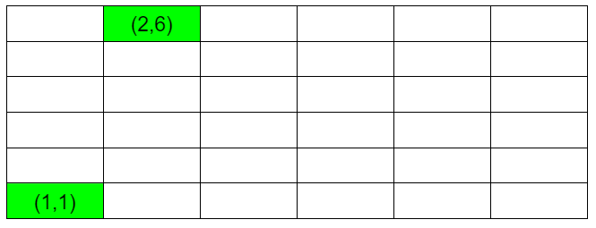

# LightOj 1266 - Points in Rectangle
### Tag
Data Structure, Binary Indexed Tree
### Quick links for prerequisites
Binary Indexed Tree:  
- https://www.geeksforgeeks.org/binary-indexed-tree-or-fenwick-tree-2
- https://cp-algorithms.com/data_structures/fenwick.html

 
### Solution 
We will maintain a 2-D BIT to solve this problem. For query 0 x y, we will insert a new point (x,y). For the second type of query, we can utilize the 2-D BIT to know how many points there are in the rectangle (1,1) to (x,y). 

Let's take a look first testcase:
```
1
4
0 1 1
0 2 6
1 1 1 6 6
1 2 2 5 5
```
-  We got two points (1,1) and (2,6), let's plot these points <br>

- In the first query, we have to find how many point are inside (1,1) and (6,6). We can easily do that by querying the BIT, the ans is 2.
- Let's come to the second query. Here we have to find the number of point inside (2,2) and (5,5). We will call query function with parameter (5,5). But it will return the number of point inside (1,1) and (5,5). The area is ploted bellow in red-  
  
- We took some extra area. Because we have to find from (2,2) to (5,5) not (1,1) to (5,5). However, the final equation of ans is - <br>
`Ans=A-B-C+D` where
  * A = Number of points in rectangle (1, 1) to (x2,y2)
  * B = Number of points in rectangle (1, 1) to (x1-1,y2-1)
  * C = Number of points in rectangle (1, 1) to (x2-1,y1-1)
  * D = Number of points in rectangle (1, 1) to (x1-1,y1-1)
let's clarify this equation. First look at the area ploted bellow of **A,B,C,D**. 
 
 
- As D is inside of both B and C. So at the time of substracting B and C , D is subtracted twice . so D is added. Now after calculating 
we got our area where no point is located. So ans of the second query is 0. Hope you understood the solution.

### Code

#### C++
```cpp
#include<bits/stdc++.h>
using namespace std;
long long int BIT[1005][1005];
bool vis[1005][1005];

void update(int x, int y , int val)
{
    while(x<=1001)
    {
        int y1=y;
        while(y1<=1001)
        {
            BIT[x][y1]+=val;
            y1+=(y1&-y1);
        }
        x+=(x&-x);
    }
}
long long int query(int x, int y)
{
    long long int sum=0;
    while(x>0)
    {
        int y1=y;
        while(y1>0)
        {
            sum+=BIT[x][y1];
            y1-=(y1&-y1);
        }
        x-=(x&-x);
    }
    return sum;
}
void solve()
{
   
   memset(BIT,0,sizeof(BIT)); //initialize with zero 
   memset(vis,false,sizeof(vis)); // initalize with zero
   long long int q,a,b,c,d,x1,y1,x2,y2;
   cin>>q;
   while(q--)
   {
      cin>>a;
      if(a==0)
      {
         cin>>a>>b;
         a++,b++;
         if(!vis[a][b])
         {
            vis[a][b]=true; 
            update(a,b,1); //update the index 
         }
      }
      else
      {
         cin>>x1>>y1>>x2>>y2;
         x1++,x2++,y1++,y2++;
         // find total point inside the given rectangle
         long long int ans=query(x2,y2)-query(x2,y1-1)-query(x1-1,y2)+query(x1-1,y1-1);
         cout<<ans<<endl;
      }
   }
   return;
}
int32_t main()
{
  int tt;
  tt = 1;
  cin>>tt;
  for(int i=1;i<=tt;i++)
  {
     cout<<"Case "<<i<<":"<<endl;
     solve();
  }
  return 0;
}
```
